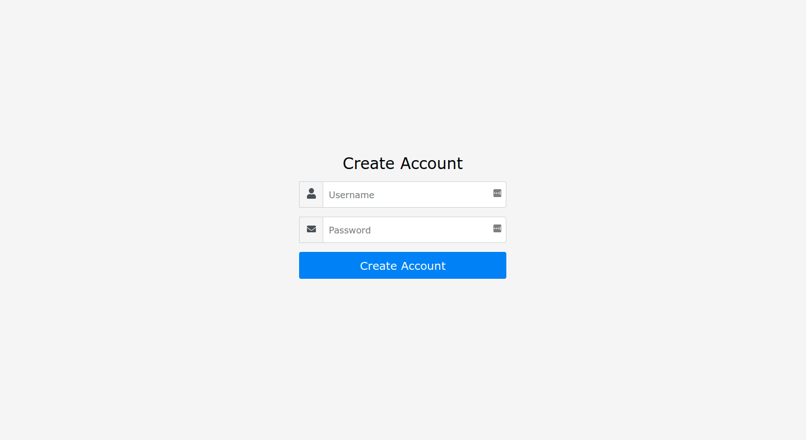
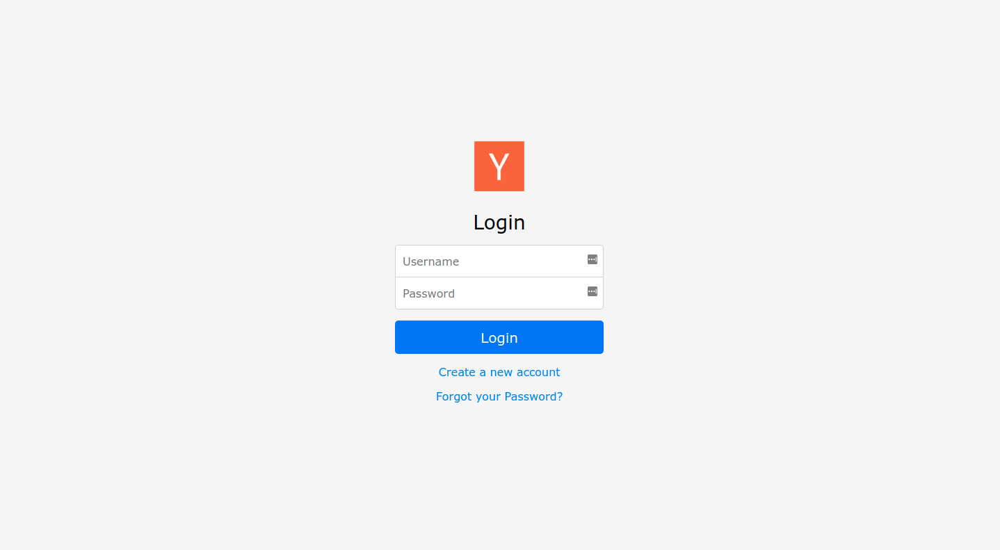
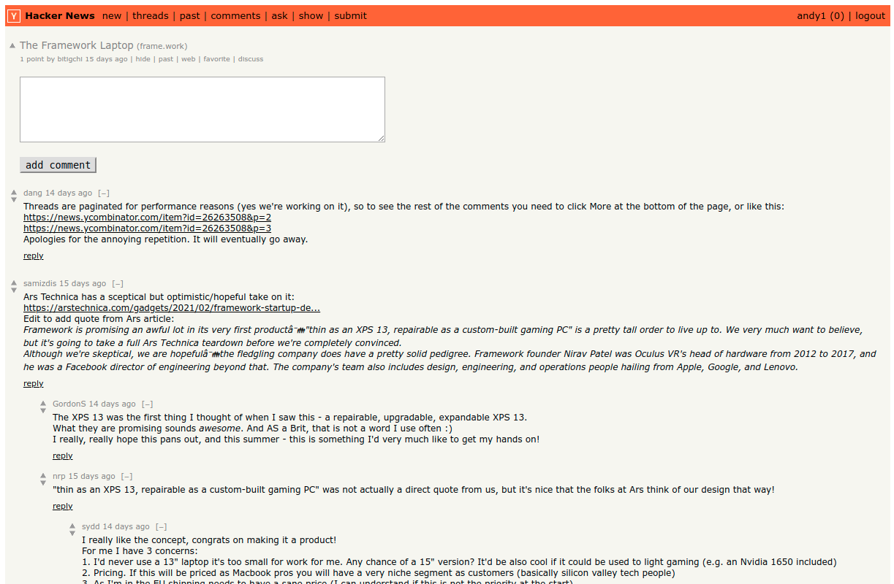
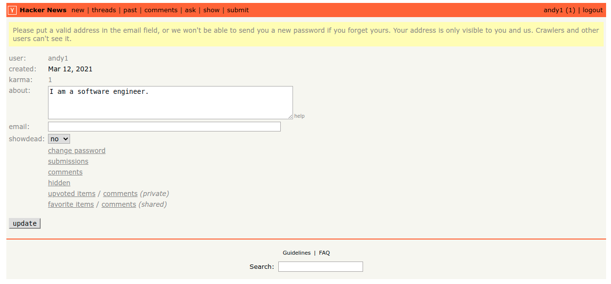

## How it works

### Screens
#### Signup

- Make sure user does not exists.
```
FT.SEARCH idx:user  (@username:"andy1") NOCONTENT LIMIT 0 1 SORTBY _id DESC
```
- Get and increase the next id in users collection.
```
GET user:id-indicator
SET user:id-indicator 64  // 64 will be next user id, 63 is current user id
```
- Create user:63 hash and json.(json also collects authToken and password hash etc)
```
HSET user:63 username andy1 email  created 1615569194 karma 0 about  showDead false isModerator false shadowBanned false banned false _id 63
JSON.SET user:63 . '{"username":"andy1","password":"$2a$10$zy8tsCske8MfmDX5CcWMce5S1U7PJbPI7CfaqQ7Bo1PORDeqJxqhe","authToken":"AAV07FIwTiEkNrPj0x1yj6BPJQSGIPzV0sICw2u0","authTokenExpiration":1647105194,"email":"","created":1615569194,"karma":0,"showDead":false,"isModerator":false,"shadowBanned":false,"banned":false,"_id":63}'
```
- Gernerate cookie with expiration time.


#### Login

- Find user
```
FT.SEARCH idx:user  (@username:"andy1") NOCONTENT LIMIT 0 1 SORTBY _id DESC
```
- Make sure password is correct
```
JSON.MGET user:63 .
```
- Create cookie

### Newest

- Check if user has toggled hidden attribute on a specific item.
```
FT.SEARCH idx:user-hidden  (@username:"andy1") NOCONTENT LIMIT 0 10000 SORTBY _id DESC
// Result - [0, "item:4"]
```
- If that is not null
```
FT.SEARCH idx:item  (-(@id:"item:4")) (@dead:"false") NOCONTENT LIMIT 0 30 SORTBY _id ASC
```
- If it's empty array
```
FT.SEARCH idx:item (@dead:"false") NOCONTENT LIMIT 0 30 SORTBY _id ASC
// Result - [3,"item:1","item:2","item:3"]
```
- Get all items from RedisJSON
```
JSON.MGET item:1 item:2 item:3 .
// Result - [{"id":"bkWCjcyJu5WT","by":"todsacerdoti","title":"Total Cookie Protection","type":"news","url":"https://blog.mozilla.org/security/2021/02/23/total-cookie-protection/","domain":"mozilla.org","points":1,"score":1514,"commentCount":0,"created":1614089461,"dead":false,"_id":3}]]
```

### Item Detail

- Get the item object first
```
JSON.MGET item:1 .
```
- Find item:1 's root comments
```
FT.SEARCH idx:comment  (@parentItemId:"kDiN0RhTivmJ") (@isParent:"true") (@dead:"false") NOCONTENT LIMIT 0 30 SORTBY points ASC
// Result - [3,"comment:1","comment:2","comment:12"]
```
- Get those comments
```
JSON.MGET comment:1 comment:2 comment:12 .
// one comment example result - {"id":"jnGWS8TTOecC","by":"ploxiln","parentItemId":"kDiN0RhTivmJ","parentItemTitle":"The Framework Laptop","isParent":true,"parentCommentId":"","children":[13,17,20],"text":"I don&#x27;t see any mention of the firmware and drivers efforts for this. Firmware and drivers always end up more difficult to deal with than expected.<p>The Fairphone company was surprised by difficulties upgrading and patching android without support from their BSP vendor, causing many months delays of updates _and_ years shorter support life than they were planning for their earlier models.<p>I purchased the Purism Librem 13 laptop from their kickstarter, and they had great plans for firmware and drivers, but also great difficulty following through. The trackpad chosen for the first models took much longer than expected to get upstream linux support, and it was never great (it turned out to be impossible to reliably detect their variant automatically). They finally hired someone with sufficient skill to do the coreboot port _months_ after initial units were delivered, and delivered polished coreboot firmware for their initial laptops _years_ after they started the kickstarter.<p>So, why should we have confidence in the firmware and drivers that Framework will deliver :)","points":1,"created":1614274058,"dead":false,"_id":12}
```
- Using children of each comment, fetch children comments
```
FT.SEARCH idx:comment  (@dead:"false") (@_id:("3"|"7"|"11")) NOCONTENT LIMIT 0 10000 SORTBY _id DESC
```
- Iterate this over until all comments are resolved

#### Submit 

- Get next item's id and increase it
```
GET item:id-indicator
// Result - 4
SET item:id-indicator 5
```
- Create hash and RedisJSON index
```
HSET item:4 id iBi8sU4HRcZ2 by andy1 title Firebase trends type ask url  domain  text Firebase Performance Monitoring is a service that helps you to gain insight into the performance characteristics of your iOS, Android, and web apps. points 1 score 0 created 1615571392 dead false _id 4
JSON.SET item:4 . '{"id":"iBi8sU4HRcZ2","by":"andy1","title":"Firebase trends","type":"ask","url":"","domain":"","text":"Firebase Performance Monitoring is a service that helps you to gain insight into the performance characteristics of your iOS, Android, and web apps.","points":1,"score":0,"commentCount":0,"created":1615571392,"dead":false,"_id":4}'
```
#### Update Profile

- Get the user
```
FT.SEARCH idx:user  (@username:"andy1") NOCONTENT LIMIT 0 1 SORTBY _id DESC
JSON.MGET user:63 .
```
- Update new user
```
HSET user:63 username andy1 email  created 1615569194 karma 1 about I am a software engineer. showDead false isModerator false shadowBanned false banned false _id 63
JSON.SET user:63 . '{"username":"andy1","password":"$2a$10$zy8tsCske8MfmDX5CcWMce5S1U7PJbPI7CfaqQ7Bo1PORDeqJxqhe","authToken":"KJwPLN1idyQrMp5qEY5hR3VhoPFTKRcC8Npxxoju","authTokenExpiration":1647106257,"email":"","created":1615569194,"karma":1,"about":"I am a software engineer.","showDead":false,"isModerator":false,"shadowBanned":false,"banned":false,"_id":63}'
```


### Schema

#### User Schema
```javascript
{
	username: STRING, // indexed
	email: STRING,    // indexed
	karma: NUMBER,    // indexed
	password: STRING,
	settings: OBJECT,
}
```

#### There are 2 type of fields, indexed and non-indexed.
1. Indexed fields will be stored in hash using HSET/HGET.
2. Non-indexed fields will be stored in RedisJSON.


- Create RediSearch Index
When schema is created, it should created index.
```
FT.CREATE idx:user ON hash PREFIX 1 "user:" SCHEMA username TEXT SORTABLE email TEXT SORTABLE karma NUMERIC SORTABLE
```

- Drop RediSearch Index
Should drop/update index if the schema has changed
```
FT.DROPINDEX idx:user
```

- Get RediSearch Info
Validate if the fields are indexed properly. If not, it will update the index fields or drop/recreate.
```
FT.INFO idx:user
```


- Create a new user
It will require new hash and new JSON record
```
HSET user:andy username "andy" email "andy@gmail.com" karma 0
JSON.SET user:andy '{"passoword": "hashed_password", "settings": "{ \"showDead\": true }" }'
```


- Update a user
```
HSET user:1 username "newusername"
JSON.SET user:andy username "newusername"
```

- Find user with username 'andy'
1. Find  the user's hash first
```
FT.SEARCH idx:user '@username:{andy}'
```
2. Fetch the JSON object to get the related JSON object
```
JSON.GET user:andy
```

- Find user whose id is andy1 or andy2
```
FT.SEARCH idx:user '@id:("andy1"|"andy2")'
```

- Find user whose id is not andy1 or andy2
```
FT.SEARCH idx:user '(-(@id:("andy1"|"andy2")))'
```

- Find user whose id is andy1 or username is andy
```
FT.SEARCH idx:user '(@id:"andy1") | (@username:"andy")'
```

- Find user whose id is andy1 and username is andy
```
FT.SEARCH idx:user '(@id:"andy1") (@username:"andy")'
```

- Find first 10 users order by username
```
FT.SEARCH idx:user '*' LIMIT 0 10 SORTBY username ASC
```

- Find next 10 users
```
FT.SEARCH idx:user '*' LIMIT 10 20 SORTBY username ASC
```

- Get from RedisJson from multiple keys
```
JSON.MGET idx:user "andy1" "andy2" "andy3"
```


## Pull Hacker News API to seed database
Using [API](https://github.com/HackerNews/API), it pulls the latest hackernews data.

Seed top stories from hacker news
```
node ./backend/scripts/seed.js
```

## Running Locally

#### .env

Copy `.env.sample` to `.env` and provide the values.
#### Start the dev server
```sh
npm run dev
```

#### Start the production server
```sh
npm run build
npm start
```